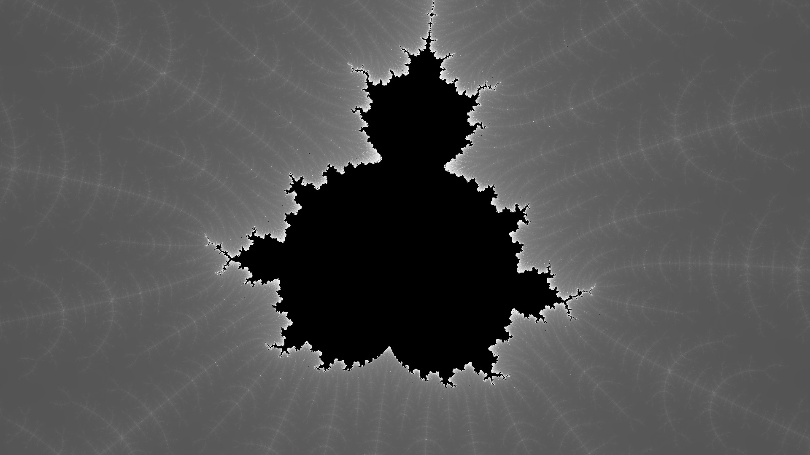
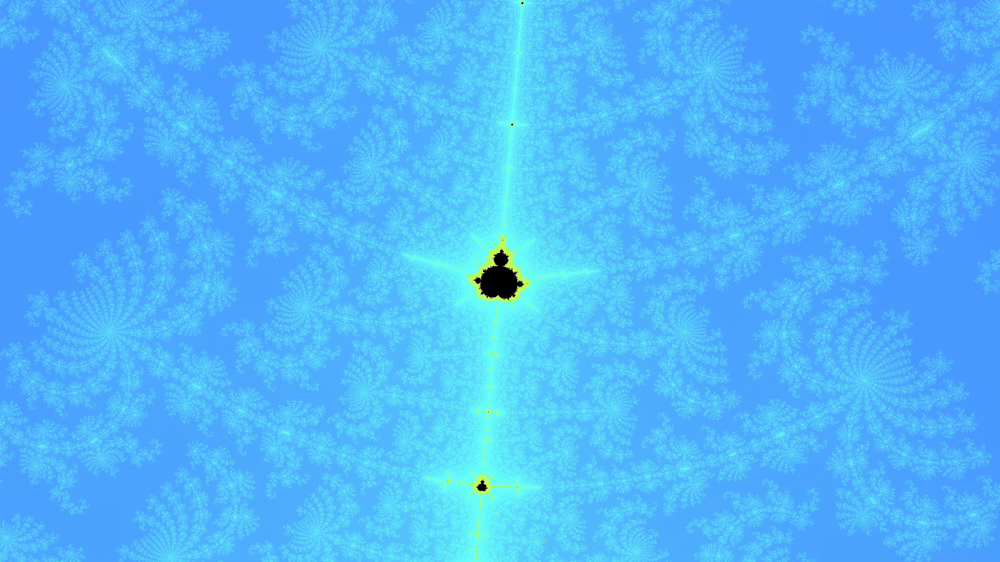
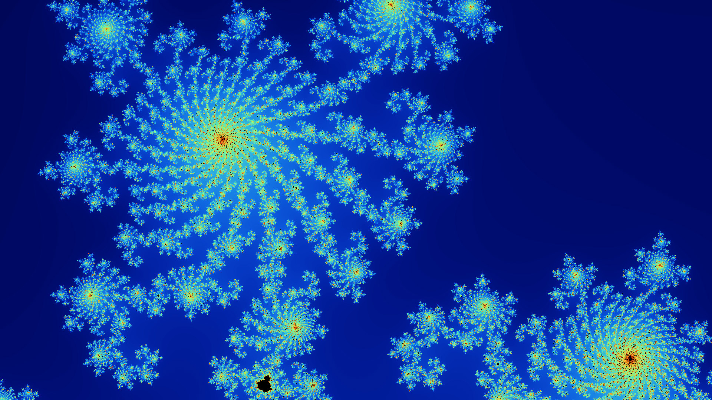

# INFORMATION

This program will simulate the mandelbrot equation.  
There is no ui; all values, such as simulation iteration-count and display resolution must be edited in the code.  
Written for x86 machines, using SFML.

## BUILD

To build, run `make`. The executable will be in the `dist/` directory.

To run: `./dist/mandelbrot`

## CONTROLS

**Mouse**:
Put the cursor where you would like to zoom in, scroll to zoom in or out.

**Keyboard Controls:**
| Key  | Action                  |
|------|-------------------------|
| A    | Zoom Out               |
| D    | Zoom In                |
| F    | Enter/Exit fullscreen  |
| R    | Reset to default view  |
| S    | Take a screenshot      |
| ESC  | Close the window       |

# Future Ideas:

1. Change Color Scheme While Running
2. Offload Rendering to gpu shaders
3. Smooth scroll
4. Drag to move around

## Example Images

